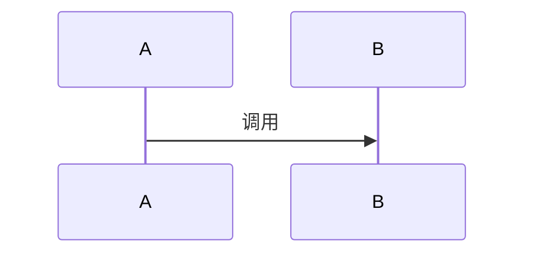

# 技术方案：测试

## 一、需求概述

测试需求。

## 二、接口变更

不涉及外部接口变更。

## 三、核心修改

核心逻辑调整。

## 四、时序图

## 五、影响分析

影响范围可控。

## 六、工时预估

预估工时 1 人日。

## 七、测试要点

补充单元测试。

## 八、风险评估

风险较低。

## 九、备注

无。

## 附录I

需求拆解。

## 附录II

变更影响分析。

## 附录III

场景扩展分析。

## 附录IV

多视角架构分析。
