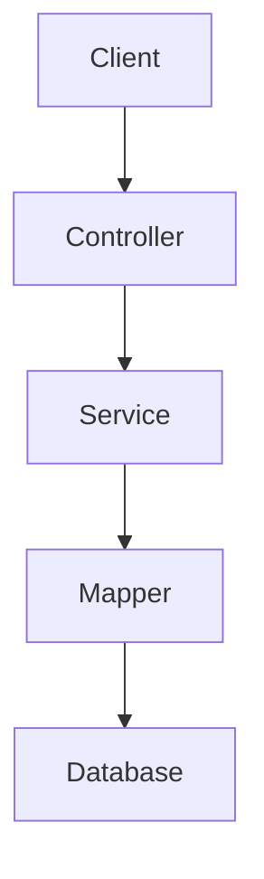
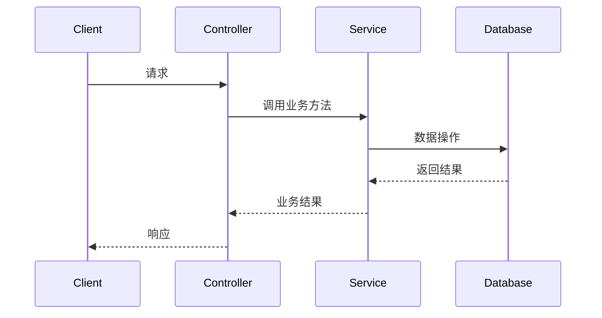

# 技术设计方案

## 概述

<!-- 一句话说明本次技术方案的核心内容 -->

## 架构设计

### 系统架构图



### 时序图（复杂流程）



## 分层设计

### Controller 层

| 类名 | 方法 | 接口路径 | 说明 |
|------|------|---------|------|
| {Controller} | {method} | {path} | {说明} |

### Service 层

| 类名 | 方法 | 说明 |
|------|------|------|
| {Service} | {method} | {说明} |

### Mapper 层

| 类名 | 方法 | SQL 类型 | 说明 |
|------|------|---------|------|
| {Mapper} | {method} | SELECT/INSERT/UPDATE/DELETE | {说明} |

## 数据库设计

### 新增表

```sql
CREATE TABLE {table_name} (
    id BIGINT PRIMARY KEY AUTO_INCREMENT,
    -- 字段定义
    created_at DATETIME DEFAULT CURRENT_TIMESTAMP,
    updated_at DATETIME DEFAULT CURRENT_TIMESTAMP ON UPDATE CURRENT_TIMESTAMP
);
```

### 修改表

```sql
ALTER TABLE {table_name} ADD COLUMN {column_name} {type};
```

### 索引设计

```sql
CREATE INDEX idx_{name} ON {table}({columns});
```

## 核心算法

<!-- 描述关键业务逻辑的实现思路 -->

## 异常处理

| 异常类型 | 场景 | 处理方式 |
|---------|------|---------|
| {Exception} | {场景} | {处理方式} |

## 性能考量

- {性能优化点}
- {缓存策略}
- {批量操作优化}

## 安全考量

- {权限控制}
- {数据脱敏}
- {SQL 注入防护}

## 兼容性

### 向后兼容

- {兼容性保障措施}

### 版本迁移

- {数据迁移脚本}
- {接口版本管理}
