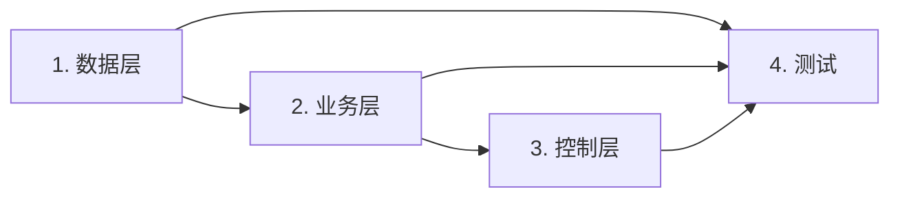

# 实现任务清单

## 变更概览

| 维度 | 数量 |
|------|------|
| 新增接口 | {N} 个 |
| 修改接口 | {N} 个 |
| 新增表 | {N} 个 |
| 修改表 | {N} 个 |

## 任务列表

### 1. 数据层 (Mapper)

- [ ] 1.1 创建 {Entity}Mapper 接口
- [ ] 1.2 实现 {Entity}Mapper.xml 映射文件
- [ ] 1.3 创建 {Entity}DO 实体类

### 2. 业务层 (Service)

- [ ] 2.1 创建 {Entity}Service 接口
- [ ] 2.2 实现 {Entity}ServiceImpl
- [ ] 2.3 实现核心业务逻辑方法

### 3. 控制层 (Controller)

- [ ] 3.1 创建 {Entity}Controller
- [ ] 3.2 实现 RESTful 接口

### 4. 测试

- [ ] 4.1 编写单元测试（见 test_spec.md）
- [ ] 4.2 运行测试并修复失败用例
- [ ] 4.3 确认覆盖率 ≥80%

## 依赖关系

## 阻塞记录

> 若实现过程中遇到阻塞，在此记录并标注阻塞原因。

| 任务ID | 阻塞原因 | 解决方案 | 状态 |
|--------|---------|---------|------|
| - | - | - | - |
