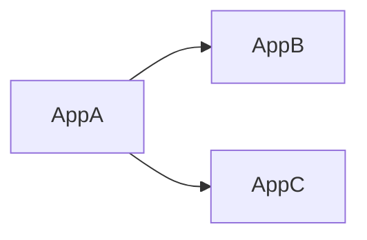
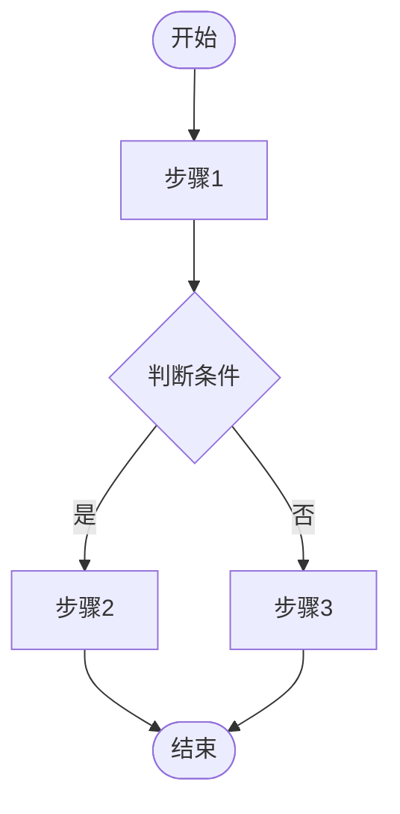
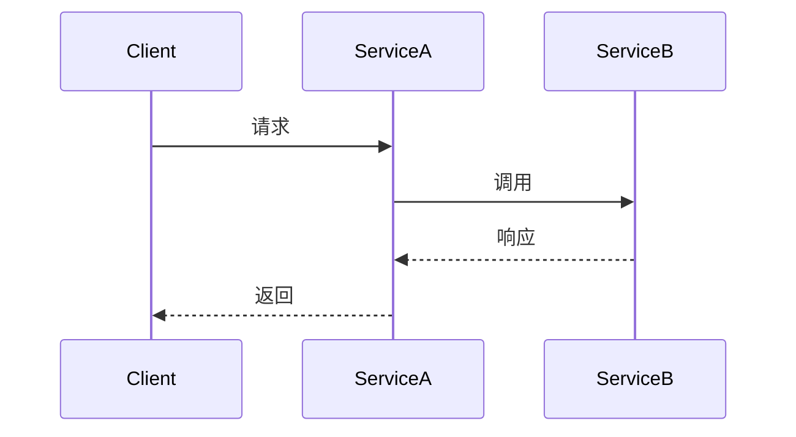
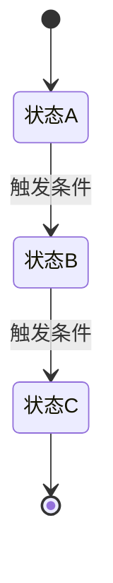

# 技术方案模版

> Stage 2 子代理生成 `tech-design` 时遵循本模版的结构。
> 所有图表强制使用 Mermaid，禁止 ASCII art（见 `../../docs/flow-contract.md#图表格式规范`）。

---

## 文档结构

### 一、时间轴

| 阶段 | 时间 | 说明 |
|------|------|------|
| 需求评审 | 待确认 | |
| 技术方案评审 | 待确认 | |
| 开发&自测 | 待确认 | |
| 联调&集测 | 待确认 | |
| 发布上线 | 待确认 | |

---

### 二、项目概述

#### 项目背景【必填】

> 需求背景是什么，需要解决什么问题

#### 项目目标【必填】

##### 业务目标

##### 技术目标

#### 项目价值【必填】

> 项目预期产出什么价值，需要量化

#### 涉及范围【必填】

> 本次方案涉及到的业务具体范围：涉及哪些仓库、哪些业务场景、哪些业务功能

#### 术语定义【必填】

| 术语名称 | 术语释义 |
|---------|---------|
| | |

#### 相关文档

> PRD、拆分需求、涉及其他域相关技术设计文档

---

### 三、详细设计

#### 应用依赖关系【必填】

> 如有涉及多个应用交互，描述各个应用之间的调用关系；如有依赖变更需颜色标识说明



#### 业务流程图【必填】

> 描述组织内部或跨组织的业务活动和交互；如涉及变更需颜色标识



#### 用例分析【必填】

> 基于业务流程图分析得出的角色（业务/系统）变更、业务操作变更

#### 系统流程图【必填】

> 描述系统内部模块、组件、数据流和控制流；建议使用时序图



#### 领域/数据模型【必填】

> 只要涉及数据表结构变更或领域模型变更则必填；如本次不涉及，需说明原因

#### 状态机【必填】

> 涉及到状态新增或修改、触发状态变更的边条件有变更都需要画出状态图；如不涉及，需说明原因



#### 功能点改动清单【必填】

| 相关域 | 应用 | 功能点 | 改动内容 |
|--------|------|--------|---------|
| | | | |

#### 接口定义【必填】

> 如不涉及则需要说明原因

##### 接口清单

| 接口协议 | 接口名称 | 接口用途 | 生产方 | 消费方 | 是否需要压测 |
|---------|---------|---------|--------|--------|------------|
| DUBBO/HTTP/MQ | | | | | |

##### 接口具体描述

###### 接口名称：{接口名}

操作类型：新增/修改

| 字段 | 说明 |
|------|------|
| 接口协议 | MQ/HTTP/DUBBO |
| 接口地址 | URL 或 class#method |
| 入参说明 | 参数名、说明、类型、是否必填 |
| 出参说明 | 参数名、说明、类型 |

---

### 四、稳定性设计

#### 稳定性分析【必填】

| 类别 | 明细评估项 | 是/否 | 具体分析说明 | 避免风险的方式 |
|------|----------|-------|------------|-------------|
| 业务影响分析 | 是否可能影响到老业务场景 | | | |
| 容量风险分析 | 数据量是否会激增 | | | |
| 性能风险分析 | 接口QPS/TPS是否存在大量调用 | | | |
| 性能风险分析 | 是否存在大量IO操作 | | | |
| 性能风险分析 | 是否存在大流量导致消息积压 | | | |
| 兼容性设计分析 | 新老数据上线是否出现不兼容 | | | |
| 兼容性设计分析 | 新老接口是否出现不兼容（dubbo/http/mq） | | | |
| 资损风险分析 | 数据异常是否可能导致资损赔付 | | | |
| 资损风险分析 | 接口异常是否可能导致资损赔付 | | | |
| 安全审计风险分析 | 接口是否涉及越权 | | | |
| 安全审计风险分析 | 数据是否涉及脱敏 | | | |
| 数据库影响分析 | 新功能是否涉及表索引变更 | | | |
| 数据库影响分析 | 数据是否涉及硬删除 | | | |
| 数据库影响分析 | 数据库查询存在大批量查询 | | | |
| 并发访问控制分析 | 接口并发场景下是否出现数据不一致 | | | |
| 并发访问控制分析 | 接口是否有幂等且幂等字段是否合理 | | | |
| 数据一致性分析 | 是否存在上下游数据不一致性风险 | | | |
| 数据一致性分析 | 接口调用异常是否有兜底手段 | | | |
| 三方依赖风险分析 | 是否涉及三方接口调用 | | | |
| 三方依赖风险分析 | 是否涉及中间件依赖（redis/mongodb/kafka/es等） | | | |
| 发布依赖风险分析 | 发布过程中是否存在顺序依赖 | | | |
| 部署风险分析 | 是否需要单独部署 | | | |

#### 发布三板斧设计【必填】

##### 可灰度

> 发布灰度：可按环境、按流量进行验证
> 业务灰度：说明业务场景灰度的粒度和具体方案

##### 可监控

> 流量监控、异常监控（最好有大盘监控）；监控大盘也可作为是否达到业务目标的量化手段

##### 可应急

> 回滚方案及应急预案，确保上线后出现问题时能快速止血

---

### 五、测试策略【必填】

> 本章节定义测试策略，包括单元测试和集成测试的策略选择。若无特殊说明，默认采用 mock-first 策略（所有外部依赖 mock）。

#### 5.1 单元测试策略

| 配置项 | 值 | 说明 |
|--------|-----|------|
| 测试框架 | junit5+mockito / junit4+mockito | 根据项目实际依赖选择 |
| Mock 策略 | mock-first | 默认强制 mock 所有外部依赖（DB、第三方接口、MQ） |

#### 5.2 集成测试策略

| 配置项 | 值 | 说明 |
|--------|-----|------|
| 启用状态 | true / false | 是否启用集成测试 |
| 执行层级 | integration（独立 job） | 集成测试不在 CI 快速通道执行 |

#### 5.3 集成测试例外声明

> mock-first 策略的例外场景。若无例外，填写"无"。

```yaml
integration_tests:
  enabled: true/false
  exceptions:
    - scope: "<测试类名或测试方法范围>"
      reason: "<申请例外的原因>"
      type: "<例外类型>"
      tool: "<使用的工具>"
```

**例外类型说明**：

| 例外类型 | 说明 | 推荐工具 |
|---------|------|---------|
| DB_INTEGRATION | 复杂 SQL 查询（join > 2 表，或含动态条件）需真实 DB 验证 | Testcontainers（H2/真实 DB 镜像） |
| SDK_INTEGRATION | 第三方 SDK 内置状态机，需模拟真实行为 | Testcontainers 或 WireMock |
| DB_TRANSACTION | 数据库事务/乐观锁/悲观锁等并发问题验证 | Testcontainers |
| MQ_INTEGRATION | 消息幂等性验证 | Testcontainers（RocketMQ/Kafka 镜像） |
| FS_INTEGRATION | 文件系统操作（非临时文件） | 本地临时目录，无需 Testcontainers |

**明确不允许例外的场景**：
- 纯业务逻辑计算（无 IO）
- HTTP 接口调用（用 WireMock/MockServer 代替真实调用）
- 外部业务系统接口（永远 mock，不依赖对方环境可用性）

---

### 六、工作量拆分

| 所属域 | 涉及应用 | 改动点详情 | 研发工作量（d） | 开发负责人 |
|--------|---------|-----------|--------------|---------|
| | | | | |

#### 首版研发工时预估【必填】

> 该预估供 OpenSpec 阈值判断与 TDD 测试模式使用，属于 AI 首版估算，用户后续可继续修改。

| 口径 | 预估值 | 说明 |
|------|--------|------|
| 估算人日 | | 供 `threshold_person_days` 比较使用 |
| 预估区间 | | 如 `3-5 人日` |
| 关键影响因子 | | 如接口数量、表变更、外部系统、联调复杂度 |
| 人工确认状态 | 待确认 | 用户可在确认门或文档中直接修改 |

---

### 七、评审记录

**评审状态**：未评审

**评审人员**：

> 参与人员需要有方案相关的开发同学和TL、架构师、测试

**评审纪要**：

| 评审问题点 | 提出人 | 跟进人 | 预计解决时间 |
|----------|--------|--------|------------|
| | | | |

**结论**：

| 结论说明 | 决策人 |
|---------|--------|
| | |

---

### 附录：需求复杂度估算

> 供 OpenSpec / TDD 直接读取，必须与上方“首版研发工时预估”保持一致。

改动接口数：  
改动表数：  
新增/修改类数：  
涉及外部系统：是/否  
估算人日：  
预估说明：  
人工确认状态：待确认

---

### 附录II：复杂度分级判断

> 技术方案阶段自动判断并输出推荐档位及依据。

#### 档位判断结果

| 项目 | 值 |
|------|----|
| 推荐档位 | nano / lite / full |
| 判断依据 | 见下方详细分析 |
| 人工确认状态 | 待确认 |

#### 规模维度分析

| 指标 | 实际值 | nano | lite | full |
|------|--------|------|------|------|
| 预估人日 | | < 0.5 | 0.5 ~ 3 | > 3 |
| 涉及文件数 | | ≤ 3 | 4 ~ 15 | > 15 |
| 涉及应用数 | | 1（局部改动） | 1 | > 1 |

#### 风险维度分析

| 风险类型 | 涉及 | 影响 |
|---------|------|------|
| 涉及资金、库存、状态机 | 是/否 | 强制升级到 full |
| 涉及数据一致性（分布式事务） | 是/否 | 强制升级到 full |
| 涉及对外 API 接口变更 | 是/否 | 升级到 lite 或 full |
| 涉及权限边界变更 | 是/否 | 升级到 lite |

#### 协作维度分析

| 协作范围 | 实际情况 | 影响 |
|---------|---------|------|
| 跨团队需求 | 是/否 | 升级到 full |
| 多应用需求 | 是/否 | 升级到 full |
| 单团队单应用 | 是/否 | 维持 lite |

#### 推荐流程

| 流程节点 | nano | lite | full |
|---------|------|------|------|
| 知识库梳理 | 跳过 | 执行 | 执行 |
| MRD 澄清 / PRD | 跳过（tech-only） | 执行 | 执行 |
| 技术方案 | 简化版 | 标准版 | 完整版 |
| OpenSpec | 跳过 | 按触发规则决定 | 强制执行 |
| 代码生成 + TDD | 执行 | 执行 | 执行 |
| GitNexus 影响分析 | 跳过 | 可选 | 强制 |
| 归档 | 轻量归档 | 标准归档 | 完整归档 |

---

## 生成质量要求

| 检查项 | 标准 |
|--------|------|
| 必填节完整 | 所有【必填】节均有实质内容，不得留占位符 |
| 图表格式 | 全部使用 Mermaid，无 ASCII art |
| 稳定性分析 | 每行均已填写是/否及分析说明 |
| 三板斧完整 | 可灰度/可监控/可应急各有具体方案描述 |
| 接口定义 | 如无接口变更，明确说明「本次无接口变更」 |
| 工时预估 | 必须包含“首版研发工时预估”和“附录：需求复杂度估算”，且 `估算人日` 非空 |
