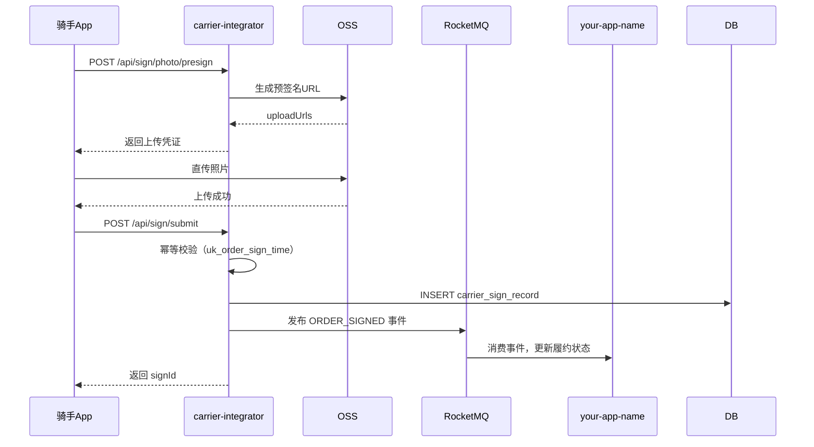

# 技术方案 — 当面开箱拍照签收（your-app-name）

> 飞书原文：https://your-domain.feishu.cn/wiki/GzDQwjJ7RinnqUkiMNGc6i6qnpg
> 生成时间：2026-04-10

---

## 一、需求概述

快递员当面开箱拍照签收，需要在 carrier-integrator 中实现：
1. OSS 预签名 URL 生成接口（供前端直传）
2. 签收记录提交接口（幂等）
3. 签收完成后发布 MQ 事件
4. 签收记录查询接口

---

## 二、接口变更清单

### 2.1 新增接口

#### POST /api/sign/photo/presign
生成 OSS 预签名上传 URL

**请求**：
```json
{
  "orderId": "O202604100001",
  "fileCount": 3,
  "fileType": "jpg"
}
```

**响应**：
```json
{
  "code": 0,
  "data": {
    "uploadUrls": [
      {
        "index": 1,
        "uploadUrl": "https://oss.xxx.com/sign/photo/O202604100001/1.jpg?sign=...",
        "fileKey": "sign/photo/O202604100001/1.jpg"
      }
    ],
    "expireAt": 1745000000
  }
}
```

#### POST /api/sign/submit
提交签收记录

**请求**：
```json
{
  "orderId": "O202604100001",
  "signTime": 1745000000,
  "photoKeys": ["sign/photo/O202604100001/1.jpg"],
  "courierId": "C001",
  "remark": ""
}
```

**响应**：
```json
{
  "code": 0,
  "data": {
    "signId": "S202604100001",
    "duplicate": false
  }
}
```

#### GET /api/sign/query
查询签收记录

**请求参数**：`orderId`, `pageNo`, `pageSize`

---

## 三、DB Schema

### 新增表：carrier_sign_record

```sql
CREATE TABLE `carrier_sign_record` (
  `id`          BIGINT      NOT NULL AUTO_INCREMENT COMMENT '主键',
  `sign_id`     VARCHAR(64) NOT NULL COMMENT '签收ID（业务主键）',
  `order_id`    VARCHAR(64) NOT NULL COMMENT '订单ID',
  `courier_id`  VARCHAR(64) NOT NULL COMMENT '快递员ID',
  `sign_time`   BIGINT      NOT NULL COMMENT '签收时间戳（秒）',
  `photo_keys`  TEXT        NOT NULL COMMENT '照片OSS key列表（JSON数组）',
  `status`      TINYINT     NOT NULL DEFAULT 1 COMMENT '状态：1有效 0无效',
  `create_time` DATETIME    NOT NULL DEFAULT CURRENT_TIMESTAMP,
  `update_time` DATETIME    NOT NULL DEFAULT CURRENT_TIMESTAMP ON UPDATE CURRENT_TIMESTAMP,
  PRIMARY KEY (`id`),
  UNIQUE KEY `uk_order_sign_time` (`order_id`, `sign_time`) COMMENT '幂等键',
  KEY `idx_courier_id` (`courier_id`),
  KEY `idx_create_time` (`create_time`)
) ENGINE=InnoDB DEFAULT CHARSET=utf8mb4 COMMENT='快递员签收记录表';
```

---

## 四、核心逻辑设计

### 4.1 签收提交时序图



### 4.2 幂等处理

利用数据库唯一键 `uk_order_sign_time`（orderId + signTime）实现幂等：
- 首次提交：正常写入，返回 `duplicate=false`
- 重复提交：捕获 `DuplicateKeyException`，查询已有记录返回，`duplicate=true`

### 4.3 MQ 消息格式

Topic：`CARRIER_SIGN_TOPIC`
Tag：`ORDER_SIGNED`

```json
{
  "signId": "S202604100001",
  "orderId": "O202604100001",
  "courierId": "C001",
  "signTime": 1745000000,
  "photoUrls": ["https://oss.xxx.com/sign/photo/..."]
}
```

---

## 五、工时预估

### 附录I — 需求复杂度估算

| 任务 | 工时（人日） |
|---|---|
| OSS 预签名接口 | 0.5 |
| 签收提交接口（含幂等） | 1.0 |
| MQ 事件发布 | 0.5 |
| 签收记录查询接口 | 0.5 |
| DB 建表 + 单测 | 0.5 |
| **合计** | **3.0 人日** |

> OpenSpec 阈值：5 人日。本需求 3.0 人日，不触发 OpenSpec。
